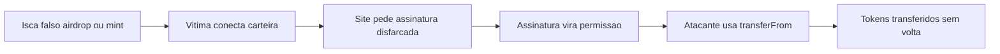
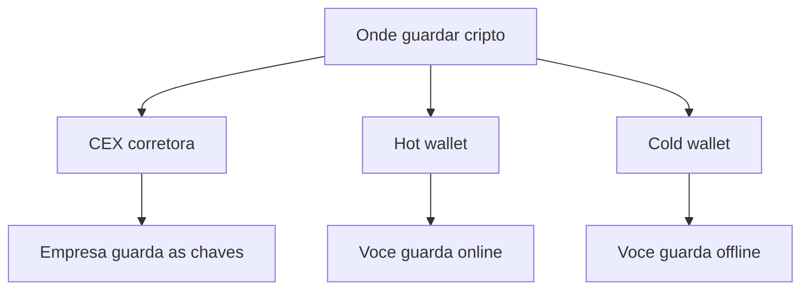
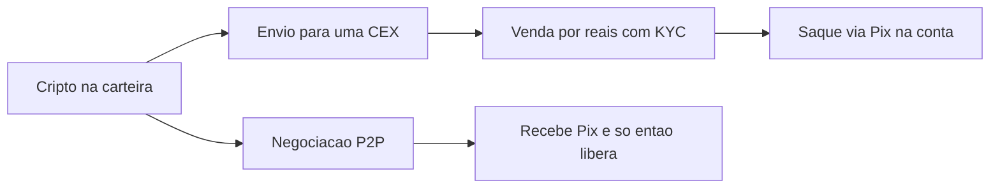
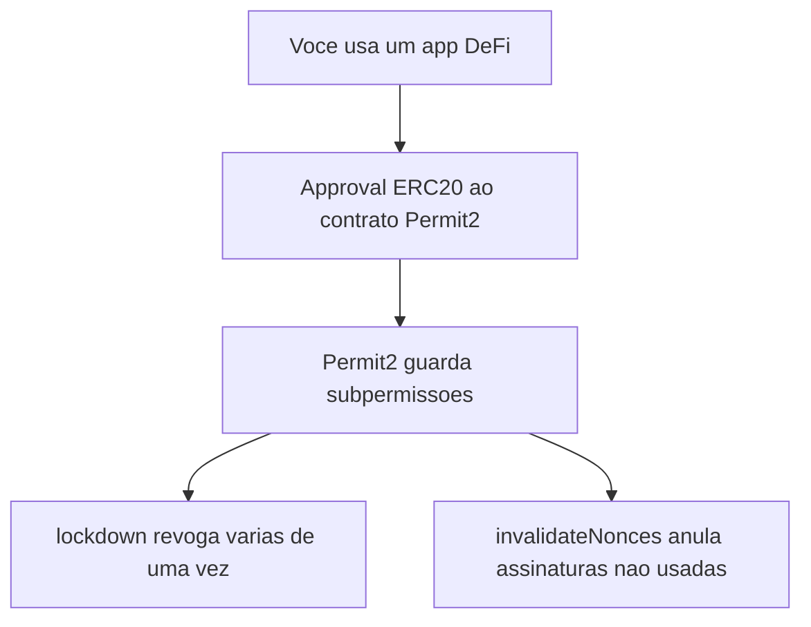

# PESQUISA-MODULO-1.md — Módulo 1: Fundamentos & Segurança Cripto

> **TL;DR**
> - O rascunho de 2025 continua **majoritariamente correto** em fundamentos (blockchain, custódia, seed, drainers), mas quatro pontos envelheceram e foram corrigidos aqui: a fatia do afiliado nos kits de drainer (o topo de "95%" **não se sustenta**; o correto é ~75–90%, mais comum 80–85%), o mercado brasileiro de corretoras (Bitso, Coinext, NovaDAX, Digitra e Bitnuvem **anunciaram saída do varejo em 2026** por causa da nova regulação do Banco Central), o surgimento do vetor de golpe **EIP-7702** (maio de 2025) e a **queda de 83% nas perdas com drainers em 2025**.
> - O que se confirmou: Revoke.cash cobre 100+ redes e aceita endereço/ENS sem conectar carteira; o Token Approval Checker do Etherscan existe; a integração Binance Pay + Pix via Z.ro Bank foi lançada em maio de 2025 (permanência exata em set/2026 **NÃO VERIFICADA**).
> - Nada neste material é conselho financeiro, jurídico ou tributário; marcas aparecem só como exemplos de categoria, nunca como recomendação.

---

## resumo
Este módulo ensina, do zero, o que é uma blockchain e por que uma transação registrada nela não pode ser apagada; onde guardar cripto (corretora, carteira quente e carteira fria); por que a "seed phrase" É a sua carteira; e como funcionam os golpes de esvaziamento de carteira ("wallet drainers"). Também mostra, em nível de categoria e sem recomendar nenhuma empresa, como transformar cripto em reais no Brasil e alerta que o mercado brasileiro mudou muito com a regulação do Banco Central que passou a valer em fevereiro de 2026. Nada aqui é conselho financeiro, jurídico ou tributário.

## objetivos
- Ao fim deste módulo você consegue explicar, com suas palavras, o que é uma blockchain e o que a torna imutável, e ler uma transação num explorador de blocos.
- Ao fim deste módulo você consegue diferenciar corretora (CEX), carteira quente e carteira fria, dizendo quem guarda as chaves em cada caso.
- Ao fim deste módulo você consegue proteger sua seed phrase e reconhecer as formas concretas de perder tudo.
- Ao fim deste módulo você consegue identificar o roteiro de um golpe de drainer e revogar aprovações perigosas.
- Ao fim deste módulo você consegue descrever como se saca para reais no Brasil e por que consultar um contador é obrigatório.

---

## secoes

### 1. O que é uma blockchain (para quem nunca viu)
Uma blockchain é um caderno de registros público e compartilhado. Em vez de um banco guardar sozinho a lista de quem tem o quê, milhares de computadores no mundo guardam cópias idênticas da mesma lista. Cada página desse caderno é chamada de "bloco", e cada bloco guarda um punhado de transações (por exemplo: "o endereço A enviou 2 moedas ao endereço B"). Quando um bloco enche, ele é fechado e um novo começa, formando uma corrente de blocos — daí o nome "block-chain", corrente de blocos.

O que amarra um bloco ao anterior é uma espécie de impressão digital matemática chamada "hash": um código que resume todo o conteúdo do bloco. Cada bloco carrega o hash do bloco anterior. Se alguém tentar mudar uma transação antiga, o hash daquele bloco muda, e isso quebra a ligação com todos os blocos seguintes — a fraude fica evidente para toda a rede.

Você não precisa de permissão nem de conta para "ler" a blockchain. Qualquer pessoa pode consultar qualquer transação ou endereço. Essa transparência é a base de tudo o que veremos adiante: é ela que permite auditar golpes, conferir se um pagamento chegou e revisar permissões.

- Bloco: uma "página" do caderno com várias transações.
- Hash: a impressão digital que resume um bloco e o liga ao anterior.
- Rede: os milhares de computadores que guardam cópias iguais.

### 2. Imutabilidade e "confirmações"
Imutável quer dizer "que não pode ser alterado depois de gravado". Numa blockchain, uma transação, depois de confirmada, fica registrada para sempre — não há botão de "desfazer", não há SAC que estorna. Isso é ótimo (ninguém apaga o seu saldo) e perigoso (se você mandar para o endereço errado, o dinheiro se foi).

"Confirmação" é o número de blocos que já foram fechados em cima do bloco onde a sua transação entrou. Uma transação com 1 confirmação já está na corrente; com 12, 30 ou mais confirmações, fica cada vez mais impossível de reverter, porque um atacante teria de reescrever todos aqueles blocos ao mesmo tempo. Por isso as corretoras esperam um número mínimo de confirmações antes de liberar um depósito.

Uma consequência importante para iniciantes: uma transação que **falhou** também fica registrada para sempre. Você pode ver na blockchain tentativas que não se completaram. Errar o destino, cair num golpe ou assinar algo indevido são ações que a rede executa e grava — a irreversibilidade não distingue acerto de erro.

### 3. Exploradores de blocos: como ler uma transação
Um explorador de blocos ("block explorer") é um site que funciona como um "Google da blockchain": você cola um endereço, um código de transação ou um contrato e ele mostra, de forma organizada, o que a rede registrou. Cada rede tem o seu: **Solscan** para a rede Solana, **Etherscan** para Ethereum, **BscScan** para a BNB Chain e **Basescan** para a Base. Etherscan, BscScan e Basescan são da mesma família e têm telas quase idênticas; o Solscan tem outra cara porque a Solana funciona de um jeito diferente (veremos na seção 14).

Para consultar uma transação você usa o "hash da transação" (também chamado TXID), um código longo começando com `0x` no Ethereum. Colando esse código no explorador, os campos que mais importam para um iniciante são: **Status** (Success = concluída, Failed = falhou, Pending = pendente), **From** (endereço que enviou), **To** (endereço ou contrato que recebeu), **Value** (quanto foi transferido) e **Block Confirmations** (quantas confirmações já tem).

Se no campo "To" aparecer a palavra "Contract" em vez de um endereço comum, significa que o destino é um contrato inteligente (um programa automático), não uma pessoa — é o que acontece, por exemplo, ao trocar uma moeda por outra numa corretora descentralizada.

- Explorador = janela de auditoria; a carteira é o painel, o explorador é onde você confere o que de fato aconteceu.
- Um explorador é só de leitura: ele não envia nem recebe cripto por você.
- Nota histórica: o Solscan foi adquirido pela Etherscan, o que aproximou as duas ferramentas.

### 4. Onde guardar cripto: as três categorias
Existem três grandes formas de guardar cripto, e a diferença central entre elas é uma só: **quem guarda as chaves**. "Chave" aqui significa a chave privada — o segredo que autoriza gastar o que está num endereço. Quem tem a chave manda no dinheiro. Daí o ditado do meio cripto: "not your keys, not your coins" ("se as chaves não são suas, as moedas não são suas").

A **corretora centralizada (CEX)** — como Binance ou Mercado Bitcoin, citadas aqui só como exemplos da categoria — é uma empresa que guarda as chaves por você, como um banco. É a porta de entrada mais fácil: aceita Pix, converte para reais e faz o KYC (sigla de "Know Your Customer", a checagem de identidade com CPF e documento). O preço dessa comodidade é que você depende da empresa: se ela for hackeada, bloquear sua conta ou fechar, seu acesso fica em risco.

A **carteira quente ("hot wallet")** — como Phantom, na Solana, ou MetaMask, nas redes EVM — é um programa no seu celular ou navegador em que **você** guarda as chaves, mas o aparelho está conectado à internet. É grátis, conecta em aplicativos descentralizados e é o que se usa para negociar on-chain. Como vive on-line, está exposta a phishing, a drainers e a vírus.

A **carteira fria ("cold wallet")** — como os aparelhos da Ledger e outros de hardware — guarda as chaves num dispositivo físico que fica offline. As chaves nunca tocam a internet, o que a torna a melhor opção para guardar valores por muito tempo. Em troca, custa dinheiro e é menos prática para trocas rápidas.

### 5. Em que situação cada carteira faz sentido
Não existe "a melhor" carteira; existe a certa para cada uso. Para o primeiro contato — comprar cripto com Pix e experimentar — a corretora costuma ser o ponto de partida, porque resolve conversão, KYC e suporte num só lugar. A regra prática que muita gente adota é não deixar na corretora mais do que se está disposto a perder num eventual bloqueio ou incidente.

Para usar aplicativos on-chain e negociar memecoins, a carteira quente é a ferramenta, porque conecta nos sites e assina transações. Uma prática de segurança muito citada é manter uma carteira quente **separada só para trade**, com pouco saldo, isolada da carteira onde você guarda o grosso do patrimônio.

Para guardar valor por muito tempo ("hodl"), a carteira fria é a categoria indicada, justamente porque tira as chaves da internet. Muitos usuários combinam as três: corretora para entrar e sair em reais, carteira quente com pouco dinheiro para operar, e carteira fria para o que não vai ser mexido tão cedo. Nada disso é recomendação — é a descrição de como as categorias se encaixam.

### 6. A seed phrase: o que é e por que ela É a carteira
Quando você cria uma carteira própria (quente ou fria), ela mostra uma lista de 12 ou 24 palavras em inglês e manda anotar. Essa lista é a "seed phrase" (frase-semente), também chamada de frase de recuperação. Ela segue um padrão técnico chamado BIP-39, que usa uma lista fixa de 2.048 palavras. Um exemplo público de como se parece (nunca use este para valer): "abandon ability able about above absent absorb abstract absurd abuse access accident".

Essas palavras não são uma senha que você escolheu: são a tradução legível de um número aleatório gigantesco de onde saem todas as suas chaves privadas e endereços. Doze palavras representam 128 bits de aleatoriedade; 24 palavras, 256 bits — ambos são impossíveis de adivinhar por força bruta. É por isso que se diz que as palavras **são** a carteira: com elas, qualquer pessoa recria a sua carteira inteira em qualquer aplicativo compatível, em qualquer aparelho, sem senha, sem SAC e sem período de espera.

A outra face da mesma moeda: se você perder as palavras e o aparelho quebrar, ninguém no mundo recupera o seu dinheiro — não há "esqueci minha senha". Guardar a seed com segurança é, portanto, a habilidade de segurança número um de todo o módulo.

### 7. As formas concretas de perder tudo pela seed
A regra de ouro é curta: **ninguém legítimo jamais pede a sua seed phrase**. Nenhum suporte, nenhuma corretora, nenhum airdrop, nenhum "verificador de carteira". Todo pedido de seed é golpe, sem exceção. Digitar as 12/24 palavras num site é entregar a carteira de mão beijada.

As formas mais comuns de perder tudo são: digitar a seed num site que promete um airdrop ou um "resgate"; fotografar as palavras (a foto vai para a nuvem automaticamente); salvar em nuvem, e-mail, PC, print ou WhatsApp (qualquer coisa on-line pode vazar); e contar para alguém "de confiança" que depois é hackeado ou age de má-fé.

A forma segura, por outro lado, é analógica: anotar as palavras à mão no papel (ou gravar numa placa de metal, que resiste a fogo e água) e guardar offline, longe de câmeras. Como a seed recria a carteira inteira, muitas pessoas guardam cópias em mais de um lugar físico seguro. Repare que a carteira fria protege a **chave**, mas não protege você de escrever a seed num site de golpe — a disciplina com a seed vale para todas as categorias.

### 8. Wallet drainers: o golpe que não rouba a sua seed
"Wallet drainer" (drenador de carteira) é o nome de uma família de golpes que esvazia carteiras **sem** roubar a sua seed. Em vez de pedir as palavras, o golpe faz **você mesmo assinar uma permissão** que autoriza o atacante a levar seus tokens. É uma mudança de mentalidade importante: você pode ter guardado a seed perfeitamente e ainda assim perder tudo por causa de uma assinatura.

Esses golpes viraram uma indústria chamada "drainer-as-a-service" (drenador como serviço): um grupo de desenvolvedores cria o kit e o "aluga" para golpistas menores (os "afiliados"), que espalham os sites falsos e ficam com a maior parte do valor roubado. Um estudo revisado por pares apresentado na conferência ACM Internet Measurement Conference de 2025 (Bowen He e coautores, da Universidade de Zhejiang com a BlockSec) mediu esse mercado no Ethereum entre 1º de março de 2023 e 1º de abril de 2025: US$ 135 milhões roubados de 76.582 vítimas, dos quais US$ 111,9 milhões foram para afiliados e US$ 23,1 milhões para operadores, distribuídos por 1.910 contratos de partilha de lucro, 56 operadores e 6.087 afiliados. Segundo o próprio estudo, os afiliados ficam "tipicamente com 80% a 90%" do roubo — a divisão mais comum é 80% para o afiliado e 20% para o operador (a fatia do operador observada varia de 10% a 40%).

A boa notícia é que o volume caiu muito. Segundo a plataforma de segurança Scam Sniffer (relatório publicado no início de 2026), as perdas com phishing de drainers em redes EVM caíram 83% em 2025, para US$ 83,85 milhões, atingindo 106.106 vítimas — queda de 68% no número de vítimas ante 2024, quando as perdas somaram cerca de US$ 494 milhões. Mas o mesmo relatório avisa: o ecossistema segue ativo e as perdas acompanham o mercado (sobem quando há mais atividade on-chain — o 3º trimestre de 2025, no auge do rali do Ethereum, concentrou US$ 31 milhões).

### 9. O roteiro do golpe, passo a passo
Entender a sequência desarma o golpe. Primeiro vem a **isca**: um falso airdrop, um "mint" de NFT, um falso suporte ou um anúncio patrocinado que aparece quando você pesquisa o nome de um site. Você clica e chega a um site que imita o verdadeiro.

Depois você **conecta a carteira**. Esse passo, sozinho, é inofensivo: conectar só permite que o site veja seus saldos públicos — não move nada. O problema é o passo seguinte. O site pede uma **assinatura** disfarçada de "claim" ("resgatar"), "login" ou "verificação". É aqui que o golpe acontece: a assinatura, na verdade, concede uma permissão sobre seus tokens.

Com a permissão em mãos, o atacante usa a função `transferFrom` (uma ordem que diz "transfira daquele endereço para o meu") para levar seus tokens. Como a permissão foi você quem deu, a blockchain considera tudo legítimo e a transferência é irreversível. Repare no ponto de virada: o dano não está em conectar, e sim em **assinar**. A defesa central é ler o que a carteira mostra antes de confirmar e desconfiar de qualquer "assinar mensagem" vindo de um site que você não abriu digitando o endereço você mesmo.

### 10. Os vetores técnicos que você precisa reconhecer
Os drainers usam alguns truques específicos, e vale conhecer o nome de cada um. O **approval ilimitado de ERC-20**: ERC-20 é o padrão dos tokens nas redes EVM, e "approval" é a permissão que você dá a um contrato para gastar seus tokens. Sites legítimos pedem approval para funcionar, mas golpistas pedem um approval de valor **ilimitado**, que deixa o contrato livre para esvaziar aquele token quando quiser.

As mensagens **Permit e Permit2** são um segundo vetor. Elas são assinaturas "sem gás" (sem taxa) feitas por um padrão chamado EIP-712, e aparecem na carteira como um inofensivo "assinar mensagem", não como uma transação — o que engana a vítima. O Permit2, contrato criado pela Uniswap e hoje muito usado (no mesmo endereço `0x000000000022D473030F116dDEE9F6B43aC78BA3` em várias redes EVM), concentra permissões de vários tokens. Segundo o relatório da Scam Sniffer, o maior roubo isolado de 2025, de US$ 6,5 milhões (em setembro), usou uma assinatura Permit; ataques do tipo Permit responderam por 38% das perdas nos casos acima de US$ 1 milhão.

Ainda há o **`setApprovalForAll` de NFT** (uma única assinatura que libera toda a sua coleção de NFTs de uma vez), o **address poisoning** e o **clipper malware** (ambos detalhados na seção 11), e as **extensões de navegador falsas**. Um vetor novo, surgido em 2025, é o EIP-7702 (seção 13).

- ERC-20: padrão de token nas redes EVM.
- Approval / allowance: permissão para um contrato gastar seus tokens.
- EIP-712: formato de "assinar mensagem" usado por Permit/Permit2.
- setApprovalForAll: permissão que libera todos os seus NFTs de uma coleção.

### 11. Address poisoning e clipper: quando o alvo é o endereço
Nem todo golpe passa por assinatura. O **address poisoning** ("envenenamento de endereço") explora um hábito: como os endereços são enormes, a gente confere só os primeiros e últimos caracteres. O golpista gera um endereço parecido (mesmo começo e mesmo fim) e envia para você uma transação minúscula, só para "sujar" o seu histórico. Depois, quando você for enviar de novo e copiar um endereço do histórico, pode copiar o do golpista sem perceber. Um estudo acadêmico de Tsuchiya, Dong, Soska e Christin (Carnegie Mellon University), "Blockchain Address Poisoning", apresentado no USENIX Security Symposium de 2025 (arXiv 2501.16681), mediu Ethereum e BNB Chain de julho de 2022 a junho de 2024 e identificou 270 milhões de tentativas de ataque contra 17 milhões de vítimas, com 6.633 incidentes bem-sucedidos e ao menos US$ 83,8 milhões em perdas.

O **clipper malware** é um vírus no seu aparelho que vigia a área de transferência (o "copiar e colar"). Quando ele detecta que você copiou um endereço de cripto, troca silenciosamente pelo endereço do atacante no momento em que você cola. Você copiou o endereço certo, mas cola o errado — e, como a transação é irreversível, o dinheiro se perde. A Trust Wallet documentou o caso de um único criador de malware que teria acumulado mais de US$ 560 mil trocando endereços copiados pela área de transferência pelo endereço do atacante.

A defesa contra os dois é a mesma disciplina: nunca confiar no começo-e-fim do endereço, conferir a linha inteira e, acima de tudo, enviar sempre uma **transação-teste de valor baixo** antes de mandar um valor alto. Uma carteira fria ajuda muito aqui, porque mostra o endereço de destino na telinha do próprio aparelho, fora do alcance do clipper.

### 12. Revogação de aprovações: como e o que ela não resolve
Como o dano dos drainers vem de permissões que ficam **ativas para sempre**, existe uma higiene simples: revisar e revogar approvals periodicamente. A ferramenta mais usada é o **Revoke.cash**, que cobre mais de 100 redes e permite consultar suas permissões digitando o endereço (ou um nome ENS) **sem conectar a carteira** — o que é mais seguro para só olhar. Para efetivamente revogar, aí sim você conecta a carteira e assina a revogação, que é uma transação e custa uma pequena taxa de gás.

Os próprios exploradores também têm essa função: o **Token Approval Checker do Etherscan** (e os equivalentes no BscScan e no Basescan) lista os contratos aprovados a gastar seus tokens, mostra o "valor em risco" e tem um botão "Revoke" para cada um, navegando entre os padrões ERC-20, ERC-721 e ERC-1155. É uma alternativa oficial e confiável ao Revoke.cash.

O ponto mais importante — e o que o rascunho acerta — é o que a revogação **não** resolve: ela impede usos **futuros** da permissão, mas **não recupera** o que já saiu. Se você já foi drenado, revogar só evita um segundo saque. E revogar approval não protege contra roubo de seed nem contra clipper: são problemas diferentes. Cuidado também com sites falsos de revogação: digite o endereço à mão, salve nos favoritos e nunca clique em link patrocinado quando estiver com pressa.

### 13. As duas camadas do Permit2 e o vetor novo (EIP-7702)
O Permit2 tem uma peculiaridade que confunde: ele guarda permissões em **duas camadas**. A primeira é o approval comum de ERC-20 que você deu ao contrato do Permit2 (geralmente ilimitado). A segunda são as sub-permissões que o Permit2 concede em seu nome. Para a primeira, você revoga o approval normalmente. Para a segunda, o Permit2 tem duas funções: `lockdown`, que revoga várias permissões de uma vez ("batch revoking approvals", nas palavras do próprio código da Uniswap), e `invalidateNonces`, que anula assinaturas que você já assinou mas que ainda não foram usadas. O Revoke.cash mostra as duas camadas, o que é mais fácil do que chamar o contrato na mão.

O vetor mais novo que um iniciante de 2026 precisa conhecer é o **EIP-7702**, ativado na atualização "Pectra" do Ethereum em maio de 2025. Ele permite que uma carteira comum passe a agir como um contrato inteligente e execute várias ações numa só transação. O problema: golpistas passaram a embutir, numa **única assinatura** disfarçada de troca rotineira, uma "delegação" que dá controle do endereço a um contrato do atacante, que então esvazia tudo de uma vez.

Casos reais já apareceram: em 24 de maio de 2025, uma vítima perdeu cerca de US$ 146,5 mil num ataque EIP-7702 ligado ao grupo Inferno Drainer (analisado pela SlowMist); em 24 de agosto de 2025, outra vítima perdeu mais de US$ 1,54 milhão pela mesma técnica (monitorada pela Scam Sniffer). A lição para o iniciante é a mesma de sempre, agora ainda mais forte: **uma assinatura pode valer a carteira inteira** — leia sempre o que a carteira pede antes de confirmar.

### 14. Solana vs. EVM: por que golpe e revogação mudam
As redes têm dois "modelos de conta" diferentes, e isso muda como funcionam golpes e revogações. Nas redes **EVM** (Ethereum, BNB Chain, Base e outras), como vimos, os tokens são ERC-20 e as permissões são approvals/allowances que ficam ativas até você revogar. É por isso que existe toda a disciplina de revogação da seção 12.

Na **Solana**, o modelo é outro. Cada token que você recebe abre uma conta própria, chamada "token account" (mais especificamente ATA, "Associated Token Account"), derivada do par carteira+token. Para abrir cada uma dessas contas, a Solana cobra um depósito reembolsável chamado "rent" (aluguel) — pela Alchemy, no mínimo 0,00203928 SOL por conta padrão para ficar "rent-exempt" (isenta de aluguel), equivalente a cerca de dois anos de custo de armazenamento —, que volta para você quando a conta é fechada. Os contratos na Solana são chamados de programas SPL (Solana Program Library).

Na prática, para um iniciante, basta entender: o modelo de permissão do EVM (approvals que persistem) é o que a revogação combate; na Solana, os golpes e a "faxina" da carteira giram mais em torno dessas token accounts e do rent. Os nomes das ferramentas e os passos mudam entre as duas famílias — por isso é importante saber em qual rede você está antes de aplicar qualquer receita de segurança.

### 15. Sacar para reais no Brasil e o novo marco regulatório
Há duas formas principais de transformar cripto em reais no Brasil. A primeira é a **CEX com Pix**: você vende na corretora e saca em reais via Pix, mediante KYC (identidade com CPF). A segunda é o **P2P** ("pessoa para pessoa"), em que você negocia direto com outra pessoa e recebe por Pix. No P2P, o risco é a contraparte: **nunca libere a cripto antes de confirmar que o Pix caiu de fato na sua conta** — golpistas usam comprovantes falsos e estornos.

Sobre a Binance: além do P2P, em 20 de maio de 2025 ela integrou o Pix ao Binance Pay, permitindo pagar e transferir em reais convertendo mais de 100 criptomoedas na hora. A operação é feita pelo Z.ro Bank, instituição de pagamento autorizada pelo Banco Central. Não encontrei fonte pública confirmando que esse arranjo foi encerrado ou trocou de operador até setembro de 2026; trate a permanência exata do serviço como algo a reconferir no site oficial (**NÃO VERIFICADO** para a data de referência).

A grande mudança desde o rascunho de 2025 é regulatória. Em 10 de novembro de 2025, o Banco Central publicou as Resoluções BCB 519, 520 e 521, que criaram a figura da PSAV (Prestadora de Serviços de Ativos Virtuais) e passaram a valer em 2 de fevereiro de 2026, com prazo até 30 de outubro de 2026 para as empresas em operação pedirem autorização. O efeito prático já é visível: em 2026, corretoras como **Bitso, Coinext, NovaDAX, Digitra e Bitnuvem** anunciaram o encerramento das operações de varejo no Brasil, citando o custo de se adequar (a Coinext, por exemplo, comunicou o fim em 3 de setembro de 2026). Por isso, os nomes de corretoras neste módulo são exemplos de categoria, não recomendações — e listas de "quais operam" envelhecem rápido.

### 16. Impostos: a obrigação existe (e este módulo não ensina a calcular)
Este material **não dá orientação tributária** — o objetivo aqui é só deixar claro que a obrigação existe. No Brasil, cripto é tratada como bem sujeito a tributação sobre ganho de capital, e há também obrigações de declaração. As regras mudaram nos últimos anos (Lei 14.754/2023, a "Lei das Offshores", e novas normas da Receita Federal), inclusive com um novo sistema de reporte chamado DeCripto.

A mensagem para o iniciante é dupla: primeiro, vender ou trocar cripto pode gerar imposto e ter prazo; segundo, guardar registro de todas as operações (datas, valores, taxas) é o que permite calcular corretamente. Como qualquer erro pode levar à malha fina, **consulte um contador** para o seu caso concreto. Voltaremos a mencionar isso no Módulo 4, sempre com o mesmo disclaimer.

---

## tabelaCarteiras

**Linha 1 — CEX (corretora)**
- Exemplos: Binance, Mercado Bitcoin (citados só como exemplos da categoria).
- Quem guarda as chaves: a corretora (custódia da empresa).
- Prós: fácil de usar; aceita Pix e entrada/saída em reais; faz KYC; tem suporte.
- Contras/risco: você não controla as chaves ("not your keys, not your coins"); risco de bloqueio de conta, hack ou encerramento da plataforma.
- Detalhe extra (ao expandir): desde 2 de fevereiro de 2026, só devem seguir no varejo brasileiro as corretoras que obtiverem autorização de PSAV do Banco Central (prazo para pedir: 30 de outubro de 2026); várias já anunciaram saída em 2026.

**Linha 2 — Hot wallet (carteira quente)**
- Exemplos: Phantom (Solana), MetaMask (redes EVM).
- Quem guarda as chaves: você, mas num aparelho conectado à internet.
- Prós: grátis; conecta em aplicativos descentralizados; é o que se usa para negociar on-chain.
- Contras/risco: exposta a phishing, drainers e malware; uma assinatura errada pode esvaziá-la.
- Detalhe extra (ao expandir): prática comum é manter uma carteira quente separada só para trade, com pouco saldo, isolada do patrimônio principal.

**Linha 3 — Cold wallet (carteira fria)**
- Exemplos: aparelhos de hardware da Ledger e outros fabricantes.
- Quem guarda as chaves: você, num dispositivo offline.
- Prós: as chaves nunca tocam a internet; melhor categoria para guardar por muito tempo; mostra o destino na própria telinha (defesa contra clipper).
- Contras/risco: custo do aparelho; menos prática para trocas rápidas.
- Detalhe extra (ao expandir): protege a chave, mas não protege você de digitar a seed num site de golpe; a disciplina com a seed continua valendo. Até marcas de hardware podem ter incidentes — em dezembro de 2023, a biblioteca Ledger Connect Kit foi comprometida num ataque de cadeia de suprimentos que injetou um drainer em vários aplicativos.

---

## checklistSeguranca
- [ ] Anotei minha seed phrase no papel ou em placa de metal. — Por que importa: papel e metal ficam offline; nuvem e foto podem vazar e entregar a carteira inteira.
- [ ] Nunca fotografei nem salvei a seed em nuvem, e-mail, PC ou WhatsApp. — Por que importa: qualquer cópia digital é um ponto de vazamento; a seed É a carteira.
- [ ] Nunca digito a seed em site nenhum. — Por que importa: nenhum serviço legítimo pede a seed; todo pedido é golpe.
- [ ] Guardo cópias da seed em mais de um lugar físico seguro. — Por que importa: se o único papel se perder ou queimar, o dinheiro some para sempre.
- [ ] Uso uma carteira separada só para trade, com pouco saldo. — Por que importa: se essa carteira for drenada, o grosso do patrimônio fica intacto.
- [ ] Salvei nos favoritos os sites oficiais que uso. — Por que importa: evita cair em site clonado por anúncio patrocinado ou link de DM.
- [ ] Não clico em anúncios nem em links de mensagem direta para acessar carteiras/ferramentas. — Por que importa: iscas de drainer costumam vir por anúncio e DM.
- [ ] Leio o que a carteira mostra antes de assinar qualquer coisa. — Por que importa: uma assinatura disfarçada de "login" pode dar permissão total sobre seus tokens.
- [ ] Desconfio de "assinar mensagem" vindo de site que eu não abri digitando o endereço. — Por que importa: Permit/Permit2 e EIP-7702 se escondem em assinaturas sem gás.
- [ ] Sei revisar e revogar approvals no Revoke.cash ou no Token Approval Checker do Etherscan. — Por que importa: permissões ficam ativas para sempre até serem revogadas.
- [ ] Confiro o endereço inteiro, não só o começo e o fim, antes de enviar. — Por que importa: address poisoning e clipper exploram exatamente essa conferência preguiçosa.
- [ ] Faço uma transação-teste de valor baixo antes de enviar valores altos. — Por que importa: se o destino estiver errado, você perde pouco, não tudo.
- [ ] No P2P, só libero cripto depois de confirmar que o Pix caiu na minha conta. — Por que importa: comprovante falso e estorno são golpes comuns de contraparte.
- [ ] Guardo registro de todas as operações e vou consultar um contador. — Por que importa: a obrigação tributária existe e o registro evita a malha fina.

---

## roteiroDrainer
1. **Isca.** O que a vítima vê: um anúncio, DM ou site com falso airdrop, "mint" de NFT ou "suporte" oferecendo algo grátis ou urgente. O que acontece por trás: o golpista atraiu você para um site clonado, feito com um kit de drainer alugado.
2. **Conexão da carteira.** O que a vítima vê: o botão "Connect Wallet" e a carteira mostrando os saldos. O que acontece por trás: nada é roubado ainda; conectar só deixa o site ver seus saldos públicos — é o passo que dá falsa sensação de segurança.
3. **Pedido de assinatura.** O que a vítima vê: um pop-up pedindo para "assinar" um "claim", "login" ou "verificação", muitas vezes sem cobrar taxa. O que acontece por trás: a assinatura, na verdade, concede um approval ilimitado, um Permit/Permit2 ou uma delegação EIP-7702.
4. **Uso da permissão (`transferFrom`).** O que a vítima vê: nada, ou os saldos sumindo segundos depois. O que acontece por trás: o atacante chama `transferFrom` (ou executa o lote da delegação) e transfere seus tokens para o endereço dele.
5. **Divisão do roubo.** O que a vítima vê: a carteira vazia; a transação registrada e irreversível no explorador. O que acontece por trás: um contrato divide automaticamente o valor — tipicamente 80% para o afiliado e 20% para o operador do kit.

---

## diagramas

### Diagrama 1 — Roteiro do golpe de drainer
- **titulo:** Como um drainer esvazia a carteira
- **legenda:** O dano não está em conectar, e sim em assinar.
- **codigoMermaid:**

- **versaoEmTexto:**
  1. Uma isca (falso airdrop, mint ou suporte) atrai a vítima a um site clonado.
  2. A vítima conecta a carteira, o que apenas mostra os saldos.
  3. O site pede uma assinatura disfarçada de "claim" ou "login".
  4. Essa assinatura concede uma permissão sobre os tokens.
  5. O atacante usa a permissão (transferFrom) para transferir os tokens.
  6. A transferência é registrada e não pode ser revertida.

### Diagrama 2 — Quem guarda a chave em cada carteira
- **titulo:** Quem controla as chaves
- **legenda:** Se as chaves não são suas, as moedas não são suas.
- **codigoMermaid:**

- **versaoEmTexto:**
  1. Há três formas de guardar cripto: CEX, hot wallet e cold wallet.
  2. Na CEX, a empresa guarda as chaves por você.
  3. Na hot wallet, você guarda as chaves, mas num aparelho conectado à internet.
  4. Na cold wallet, você guarda as chaves num dispositivo offline.
  5. Quanto mais controle você tem, mais responsabilidade de segurança também tem.

### Diagrama 3 — Da cripto até virar reais na conta
- **titulo:** Caminho da cripto até o Pix
- **legenda:** Dois caminhos: corretora com Pix ou P2P.
- **codigoMermaid:**

- **versaoEmTexto:**
  1. Você parte de uma cripto guardada na sua carteira.
  2. Caminho A: envia para uma corretora, vende por reais (com KYC) e saca via Pix.
  3. Caminho B: negocia P2P direto com outra pessoa.
  4. No P2P, só libere a cripto depois de confirmar que o Pix caiu na sua conta.
  5. Em ambos os caminhos, há obrigação tributária a considerar com um contador.

### Diagrama 4 — As camadas de uma aprovação (Permit2)
- **titulo:** As duas camadas do Permit2
- **legenda:** Revogar a camada certa importa.
- **codigoMermaid:**

- **versaoEmTexto:**
  1. Ao usar um app, você dá um approval de ERC-20 ao contrato do Permit2.
  2. O Permit2 passa a guardar sub-permissões em seu nome.
  3. Para revogar em lote, usa-se a função lockdown.
  4. Para anular assinaturas já feitas mas ainda não usadas, usa-se invalidateNonces.
  5. O Revoke.cash mostra as duas camadas, facilitando a revogação.

---

## quiz
1. **O que torna uma transação praticamente imutável numa blockchain?**
   - a) O suporte da corretora aprovar
   - b) O número de confirmações (blocos empilhados por cima) — **CORRETA**
   - c) O valor ser alto
   - d) Você marcar como "final"
   - Explicação: cada bloco novo em cima do seu aumenta o custo de reescrever a história; por isso corretoras esperam um mínimo de confirmações. Transações que falharam também ficam gravadas para sempre.

2. **Qual opção NÃO guarda as chaves com você?**
   - a) Cold wallet
   - b) Hot wallet
   - c) CEX (corretora) — **CORRETA**
   - d) Carteira de hardware
   - Explicação: na CEX, a empresa custodia as chaves, como um banco. Daí o ditado "not your keys, not your coins": sem as chaves, você depende da plataforma.

3. **É seguro digitar sua seed phrase num site que promete um airdrop?**
   - a) Sim, se o site tiver cadeado
   - b) Sim, se for rápido
   - c) Não, nunca — nenhum serviço legítimo pede a seed — **CORRETA**
   - d) Só na primeira vez
   - Explicação: a seed recria a carteira inteira em qualquer aparelho. Todo pedido de seed é golpe; a forma segura é mantê-la offline, no papel ou no metal.

4. **O que um "approval" malicioso permite ao atacante?**
   - a) Descobrir sua senha do e-mail
   - b) Transferir seus tokens usando uma permissão que você assinou — **CORRETA**
   - c) Ver seu CPF
   - d) Minerar Bitcoin no seu PC
   - Explicação: o golpe de drainer não rouba a seed; ele faz você assinar uma permissão e depois usa `transferFrom` para levar os tokens. Ler o que se assina é a defesa.

5. **Qual ferramenta serve para revisar e revogar aprovações?**
   - a) Revoke.cash — **CORRETA**
   - b) Google Tradutor
   - c) Um explorador só de leitura, sem conectar
   - d) O aplicativo de banco
   - Explicação: o Revoke.cash (100+ redes) e o Token Approval Checker do Etherscan listam e revogam permissões. Revogar impede usos futuros, mas não recupera o que já saiu.

6. **Você conectou a carteira num site e não assinou nada. O que aconteceu?**
   - a) Seus tokens já foram roubados
   - b) O site só passou a ver seus saldos públicos — **CORRETA**
   - c) Sua seed foi exposta
   - d) Você pagou uma taxa alta
   - Explicação: conectar, sozinho, não move fundos — apenas mostra saldos. O risco aparece no passo seguinte, quando o site pede uma assinatura disfarçada.

7. **Você copiou um endereço, mas colou outro e o dinheiro sumiu. Que golpe é esse?**
   - a) Address poisoning
   - b) Clipper malware — **CORRETA**
   - c) Permit2
   - d) Rug pull
   - Explicação: o clipper é um vírus que troca o endereço na área de transferência. Conferir a linha inteira e usar uma carteira fria (que mostra o destino na telinha) defende contra ele.

8. **Desde fevereiro de 2026, o que mudou para corretoras no Brasil?**
   - a) Nada mudou
   - b) O Pix foi proibido para cripto
   - c) Passou a valer a regra de PSAV do Banco Central, e várias corretoras encerraram o varejo — **CORRETA**
   - d) Todas as corretoras estrangeiras foram banidas para sempre
   - Explicação: as Resoluções BCB 519, 520 e 521 criaram a PSAV; empresas têm até 30/10/2026 para pedir autorização, e Bitso, Coinext, NovaDAX, Digitra e Bitnuvem anunciaram saída do varejo em 2026.

---

## fontes
- BlockSec, "Drainer-as-a-Service: Inside Ethereum's $135M Phishing Economy" — https://blocksec.com/blog/inside-ethereum-s-shadow-economy-new-research-unmasks-the-135-m-drainer-as-a-service-industry (consulta: 6 set. 2026)
- He et al., "Unmasking the Shadow Economy: A Deep Dive into Drainer-as-a-Service Phishing on Ethereum", ACM IMC 2025 — https://dl.acm.org/doi/10.1145/3730567.3764476 (consulta: 6 set. 2026)
- Recorded Future / Insikt Group, "Rublevka Team: Anatomy of a Russian Crypto Drainer Operation" (4 fev. 2026) — https://www.recordedfuture.com/research/rublevka-team-anatomy-russian-crypto-drainer-operation (consulta: 6 set. 2026)
- Scam Sniffer, "2025: Crypto Phishing Losses Fall 83% to $84 Million" — https://drops.scamsniffer.io/scam-sniffer-2025-crypto-phishing-losses-fall-83-to-84-million/ (consulta: 6 set. 2026)
- Cointelegraph, "Crypto Phishing Losses Fell 83% in 2025, Scam Sniffer Reports" — https://cointelegraph.com/news/crypto-phishing-losses-fell-83-percent-2025-wallet-drainers (consulta: 6 set. 2026)
- Revoke.cash, "How to Revoke Token Approvals and Permissions" — https://revoke.cash/learn/approvals/how-to-revoke-token-approvals (consulta: 6 set. 2026)
- Revoke.cash, "What Is Permit2?" — https://revoke.cash/learn/approvals/what-is-permit2 (consulta: 6 set. 2026)
- Etherscan, "Token Approvals | Information Center" — https://info.etherscan.com/tokenapprovals/ (consulta: 6 set. 2026)
- Uniswap, permit2 `IAllowanceTransfer.sol` (lockdown/invalidateNonces) — https://github.com/Uniswap/permit2/blob/main/src/interfaces/IAllowanceTransfer.sol (consulta: 6 set. 2026)
- GoPlus, "Understanding EIP-7702 Phishing Attacks" — https://blog.gopluslabs.io/2025/06/03/financing/2025-06-03-Understanding-EIP-7702-Phishing-Attacks-A-Comprehensive-Guide-to-Protection-Strategies-for-Wallets/ (consulta: 6 set. 2026)
- Qi et al., "EIP-7702 Phishing Attack", arXiv 2512.12174 (dez. 2025) — https://arxiv.org/abs/2512.12174 (consulta: 6 set. 2026)
- Tsuchiya, Dong, Soska, Christin (Carnegie Mellon University), "Blockchain Address Poisoning", USENIX Security Symposium 2025, arXiv 2501.16681 — https://arxiv.org/abs/2501.16681 (consulta: 6 set. 2026)
- Trust Wallet, "What is a seed phrase, and why is it important?" — https://trustwallet.com/blog/academy/what-is-a-seed-phrase-and-why-is-it-important (consulta: 6 set. 2026)
- Ledger Academy, "BIP-39" — https://www.ledger.com/academy/bip-39-the-low-key-guardian-of-your-crypto-freedom (consulta: 6 set. 2026)
- Trust Wallet, "What is an Address Poisoning Scam in Crypto?" — https://trustwallet.com/blog/security/what-is-an-address-poisoning-scam-in-crypto (consulta: 6 set. 2026)
- Merkle Science, "How Clipper Malware Poses a Threat to Crypto Transactions" — https://www.merklescience.com/blog/how-clipper-malware-poses-a-threat-to-crypto-transactions (consulta: 6 set. 2026)
- Alchemy, "What is an Associated Token Account on Solana?" — https://www.alchemy.com/overviews/associated-token-account (consulta: 6 set. 2026)
- Solana Docs, "Create a Token Account" — https://solana.com/docs/tokens/basics/create-token-account (consulta: 6 set. 2026)
- Banco Central do Brasil, apresentação "Regulamentação da prestação de serviços de ativos virtuais" (nov. 2025) — https://www.bcb.gov.br/conteudo/home-ptbr/TextosApresentacoes/AVs_mercado_cambio_%20e_capitais_coletiva1_10.11.25.pdf (consulta: 6 set. 2026)
- Mattos Filho, "Banco Central divulga normas para a regulamentação de ativos virtuais" — https://www.mattosfilho.com.br/unico/normas-regulamentacao-ativos-virtuais/ (consulta: 6 set. 2026)
- Agência Brasil, "Banco Central estabelece regras para o mercado de criptoativos" — https://agenciabrasil.ebc.com.br/economia/noticia/2025-11/banco-central-estabelece-regras-para-o-mercado-de-criptoativos (consulta: 6 set. 2026)
- Brasil Bitcoin (blog), "Corretoras de criptomoedas que estão encerrando operações no Brasil em 2026" — https://brasilbitcoin.com.br/blog/corretoras-criptomoedas-encerrando-operacoes-brasil/ (consulta: 6 set. 2026)
- Exame, "Exclusivo: corretora de criptomoedas Coinext encerra atividades" — https://exame.com/future-of-money/exclusivo-corretora-de-criptomoedas-coinext-encerra-atividades/ (consulta: 6 set. 2026)
- CNN Brasil, "Binance permite Pix para pagamento em criptos; entenda" — https://www.cnnbrasil.com.br/economia/money/macroeconomia/binance-permite-pix-para-pagamento-em-criptos-entenda/ (consulta: 6 set. 2026)
- CNN Brasil, "Criptoativos no Imposto de Renda 2026" — https://www.cnnbrasil.com.br/economia/financas/criptoativos-no-imposto-de-renda-2026-o-que-declarar-e-como-calcular/ (consulta: 6 set. 2026)
- Ledger, "Security Incident Report" (Angel Drainer / Ledger Connect Kit, dez. 2023) — https://www.ledger.com/blog/security-incident-report (consulta: 6 set. 2026)

---

## divergencias
- **Fatia de 75–95% para o afiliado no "drainer-as-a-service":** o rascunho exagera o topo. A medição revisada por pares (ACM IMC 2025, He et al.) diz que os afiliados ficam "tipicamente com 80% a 90%", sendo 80% a divisão mais comum; a fatia do operador varia de 10% a 40%. O piso de 75% é confirmado por recrutamento observado (Recorded Future/Insikt, "Rublevka Team", anúncio de abr. 2025: "starting percentage of 75% and 80% for 'experienced users'"). O topo de 95% **não** aparece em nenhuma fonte medida — só numa faixa qualitativa ampla de fornecedor. **Correção adotada:** "afiliados tipicamente ficam com 75% a 90% (mais comum ~80–85%); operador com ~10–25% (normalmente 20%)". Referência de caso concreto: Ledger reportou o Angel Drainer dividindo 85% para o atacante e 15% para o kit no incidente de dez. 2023.
- **Binance / Z.ro Bank:** confirmado que existiu (lançado em 20 de maio de 2025, operado pelo Z.ro Bank, instituição de pagamento autorizada pelo BC). **NÃO VERIFICADO** se seguia idêntico em set. 2026 — não encontrei fonte confirmando encerramento nem troca de operador; recomendo reconferir no site oficial antes de publicar como fato presente.
- **Revoke.cash (100+ redes, endereço/ENS sem conectar):** **confirmado** em 2026 (múltiplas fontes, incluindo a documentação do próprio Revoke.cash). O **Token Approval Checker do Etherscan** (e equivalentes BscScan/Basescan) também segue existindo e funcional.
- **Corretoras brasileiras com saque via Pix:** o rascunho citava Mercado Bitcoin, Bitso, Foxbit e Coinext como exemplos. **Correção importante:** em 2026, **Bitso e Coinext anunciaram encerramento do varejo no Brasil** (assim como NovaDAX, Digitra e Bitnuvem), por causa do novo marco do BC — a Bitso transferindo a base para o Mercado Bitcoin (set. 2026) e a Coinext anunciando o fim em 3 de set. 2026. Mercado Bitcoin e Foxbit seguiam operando na data da pesquisa. Todos são exemplos de categoria, nunca recomendação.
- **Vetores de golpe novos desde o rascunho:** acrescentado o **EIP-7702** (atualização Pectra, maio de 2025), que permite esvaziar a carteira inteira com uma única assinatura de delegação — casos reais de US$ 146,5 mil (24 maio 2025) e US$ 1,54 milhão (24 ago. 2025). Também detalhado o **address poisoning** com número medido (270 milhões de tentativas, CMU/USENIX 2025).
- **Mudança regulatória no Brasil:** acrescentado o marco das Resoluções BCB 519/520/521 (publicadas em 10 nov. 2025, em vigor desde 2 fev. 2026; prazo de autorização até 30 out. 2026), que não constava no rascunho e é hoje o fator que mais afeta quais corretoras seguem operando.
- **Incidente de carteira relevante:** acrescentado o ataque à Ledger Connect Kit (dez. 2023), exemplo de que até ferramentas de marcas confiáveis podem ser comprometidas por ataque de cadeia de suprimentos.
- **Queda das perdas com drainers:** o rascunho não trazia números de tendência; acrescentada a queda de 83% em 2025, de ~US$ 494 mi (2024) para US$ 83,85 mi (Scam Sniffer), contexto essencial para o iniciante não achar nem que o risco acabou, nem que é imbatível.
- **Nota metodológica cumprida:** nenhuma frase, método ou framework foi atribuído a "Jhaay" ou "Matheus Quintiliano". Todos os conceitos foram tratados como conhecimento geral de mercado e ancorados em fontes públicas independentes.