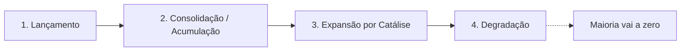

# PLANEJAMENTO.md — onchain-mastery-hub

> Documento de planejamento técnico e didático. Central de estudos local, interativa e 100% no navegador, para aprender do zero trading on-chain e memecoins (Solana e EVM). Data: setembro de 2026.
> **AVISO:** Nada aqui é aconselhamento financeiro, jurídico ou tributário. Conteúdo educacional. Trading de memecoins é atividade de altíssimo risco; a maioria dos tokens vai a zero.

## Nota sobre as referências "Jhaay" e "Matheus Quintiliano" (NÃO VERIFICADO)
O pedido cita as aulas de "Jhaay" e "Matheus Quintiliano". Fiz pesquisa dedicada (incluindo um agente de verificação com 8+ buscas em YouTube, X/Twitter, Instagram, Threads, Telegram, Discord e notícias) e **não encontrei nenhum material público verificável** que ligue esses nomes especificamente à educação de trading on-chain de memecoins. Existem homônimos (ex.: um "Matheus Quintiliano" estudante de Direito no X, outros perfis não relacionados), mas nada confirmando atuação como educador de memecoins Solana/EVM. Portanto, o hub NÃO cita frases nem frameworks atribuídos a eles. Todo o conteúdo didático vem de fontes públicas confirmáveis (documentação oficial de Raydium, Helius, MetaMask, Trust Wallet, Revoke.cash, Tailwind, Mermaid, Anthropic, exchanges brasileiras etc.), e os conceitos ("economia da atenção", "catálise", "tese de entrada", "dois pilares", "4 fases") são tratados como conhecimento geral de mercado, não como propriedade desses criadores. **Ressalva metodológica:** buscas na web indexam mal conteúdo de nicho que vive em vídeos, lives e grupos privados; a ausência de evidência não é prova de inexistência. Se Victor tiver os handles exatos, basta adicioná-los depois em `src/data/referencias.js` para uma verificação direcionada.

---

## 1. Visão geral
- **Objetivo:** um hub de estudos local que ensina, do zero e passo a passo, os fundamentos de segurança cripto, a psicologia das memecoins, as ferramentas on-chain (visualização, execução, checagem, monitoramento social) e a gestão de risco/decisão.
- **Público:** o próprio Victor — iniciante absoluto, desenvolvedor sem formação formal, usando Claude Code no Windows. Linguagem simples, sem jargão sem explicação.
- **Princípios didáticos:**
  1. Progressão do zero (cada módulo assume só o anterior).
  2. Interatividade (checklists, quizzes, simulador, glossário com busca/filtro).
  3. Dark mode, tipografia legível, acessibilidade básica.
  4. Sem backend, sem banco de dados: tudo roda no navegador; progresso salvo em `localStorage`.
  5. Conteúdo separado da lógica (arquivos de dados JS fáceis de editar).

## 2. Decisões técnicas (e justificativas)
**Stack escolhida: HTML5 + Tailwind CSS via Play CDN + JavaScript puro com ES Modules + Mermaid.js via CDN, servido por um servidor estático local. Sem build, sem Vite.**

- **Por que JS puro + ES Modules e não Vite?** Para um iniciante, eliminar a etapa de build reduz drasticamente a superfície de erro (nada de `node_modules`, versionamento de dependências, configs). ES Modules nativos (`<script type="module">`) dão organização em arquivos sem ferramenta. Se o projeto crescer, migrar para Vite depois é simples. **Recomendação: começar sem build.**
- **Por que Tailwind via Play CDN?** Estilização rápida sem passo de compilação. **Ressalva importante e verificada:** a própria Tailwind documenta, palavra por palavra, que "The Play CDN is designed for development purposes only, and is not intended for production" — ou seja, é ótimo para protótipo/estudo local, mas para publicar em produção o certo é gerar o CSS compilado (o CDN gera estilos em runtime, o que aumenta o tempo de carga e impede otimizações como tree-shaking). Como este hub é local e de estudo, o Play CDN é adequado. O Tailwind v4 expõe o Play CDN em `https://cdn.jsdelivr.net/npm/@tailwindcss/browser@4`.
- **Por que Mermaid via CDN?** Renderiza fluxogramas (as 4 fases da moeda) a partir de texto. Import como ES module: `import mermaid from 'https://cdn.jsdelivr.net/npm/mermaid@11/dist/mermaid.esm.min.mjs'`. Como o conteúdo é injetado dinamicamente (SPA por abas), usar `mermaid.initialize({ startOnLoad: false })` e depois `await mermaid.run({ nodes: [...] })` ao trocar de aba. `mermaid.init` está deprecado desde a v10 e será removido — usar `mermaid.run`.
- **Persistência com `localStorage`:** um módulo `store.js` guarda um objeto JSON com: itens de checklist marcados, termos do glossário marcados como "concluído", módulos concluídos, respostas de quiz e resultados/escolhas do simulador. Chave única (ex.: `omh_state_v1`), com `JSON.parse`/`JSON.stringify` e um fallback try/catch.
- **Navegação:** SPA simples — sidebar fixa (desktop) / menu hambúrguer (mobile) + roteador por hash (`#/modulo-1`). `router.js` lê `location.hash`, monta a view correspondente e dispara re-render. Dentro de cada módulo, abas internas quando fizer sentido.
- **Acessibilidade básica:** HTML semântico (`<nav>`, `<main>`, `<section>`, `<button>`), `aria-current` na aba ativa, foco visível, contraste AA no dark mode, navegação por teclado (Tab/Enter/Esc), `prefers-reduced-motion` para desligar animações.
- **CRÍTICO — ES Modules e `file://`:** módulos ES **não funcionam** abrindo o `index.html` direto (protocolo `file://`) por causa de CORS. É obrigatório servir por HTTP local. Opções no Windows: extensão **Live Server** do VS Code, `npx serve`, ou `python -m http.server`.
- **Sem dependência de rede além dos CDNs** (Tailwind, Mermaid, Google Fonts). Opcionalmente baixar essas libs para `assets/vendor/` no futuro para uso offline (ver Backlog).

## 3. Estrutura de pastas e arquivos
```
onchain-mastery-hub/
├── index.html                 # Página única; carrega Tailwind CDN, fontes e src/app.js (module)
├── README.md                  # Como abrir localmente no Windows, requisitos, estrutura, disclaimer
├── PLANEJAMENTO.md            # Este documento
├── CLAUDE.md                  # Regras do projeto para o Claude Code (stack, sem build, pt-BR, dark mode)
├── .gitignore                 # Ignora .vscode/, node_modules/ (se surgir), etc.
├── styles/
│   └── custom.css             # Ajustes finos que não vêm do Tailwind (scrollbar, foco, tokens de cor)
├── assets/
│   ├── icons/                 # SVGs (ícones de risco, chains, etc.)
│   └── vendor/                # (futuro) libs baixadas p/ uso offline
└── src/
    ├── app.js                 # Ponto de entrada: inicializa store, router, sidebar, tema
    ├── router.js              # Roteador por hash (#/modulo-1 ...), monta a view ativa
    ├── store.js               # Estado global + persistência em localStorage
    ├── ui.js                  # Helpers de render (cards, badges, tabs, toast, progress bar)
    ├── components/
    │   ├── sidebar.js         # Menu lateral / hambúrguer, marca módulo ativo e progresso
    │   ├── checklist.js       # Checklist interativo reutilizável (Módulo 1 segurança)
    │   ├── comparisonTable.js # Tabela interativa CEX vs Hot vs Cold; ferramentas
    │   ├── phaseFlow.js       # Renderiza as 4 fases (Mermaid ou cards Tailwind)
    │   ├── quiz.js            # Mini-quiz por módulo (3–5 perguntas), feedback e score
    │   ├── simulator.js       # Simulador de cenários do Módulo 4
    │   └── glossary.js        # Glossário com busca, filtro por categoria, marcar concluído
    └── data/
        ├── modulo1.js         # Conteúdo/objetivos/quiz do Módulo 1
        ├── modulo2.js         # Módulo 2 (psicologia, tipos, 4 fases)
        ├── modulo3.js         # Módulo 3 (dois pilares, ferramentas)
        ├── modulo4.js         # Módulo 4 (gestão, catálise, take profit)
        ├── cenarios.js        # Catálogo de cenários do simulador (>=12)
        ├── glossario.js       # >=34 termos com categoria/definição/exemplo/alerta
        └── referencias.js     # Fontes e links; espaço p/ handles se confirmados
```
Cada arquivo em `data/` exporta um objeto/array JSON-like — Victor edita conteúdo sem tocar na lógica.

## 4. Conteúdo didático por módulo (enriquecido pela pesquisa)

### MÓDULO 1 — Fundamentos & Segurança Cripto
**Objetivos de aprendizagem:** entender o que é blockchain e imutabilidade; diferenciar CEX, hot wallet e cold wallet; proteger a seed phrase; entender drenadores de carteira; saber como sacar para reais.

**Tópicos (resumo didático + fontes):**
- **Blockchain e imutabilidade:** um registro público em que cada transação é confirmada e não pode ser apagada; qualquer um audita pelos "block explorers" — **Solscan** (Solana), **BscScan** (BNB Chain), **Etherscan** (Ethereum), **Basescan** (Base). Explicação visual: bloco → confirmação → registro permanente.
- **Onde guardar cripto — tabela comparativa interativa:**

| Tipo | Exemplos | Custódia das chaves | Prós | Contras/risco |
|---|---|---|---|---|
| CEX (corretora) | Binance, Mercado Bitcoin | A corretora guarda | Fácil, tem Pix/entrada em R$, KYC | Você não controla as chaves ("not your keys, not your coins"); risco de bloqueio/hack da plataforma |
| Hot wallet | Phantom (Solana), MetaMask (EVM) | Você (na internet) | Grátis, conecta em dApps, negocia on-chain | Exposta a phishing, drainers, malware |
| Cold wallet | Ledger e outros hardware | Você (offline) | Chaves nunca tocam a internet; melhor p/ guardar | Custo do aparelho; menos prático p/ trade rápido |

- **Guia crítico da seed phrase:** as 12/24 palavras SÃO a carteira. Nunca digitar em site, nunca fotografar, nunca salvar em nuvem/PC/print/WhatsApp. Anotar em papel (ou placa de metal) e guardar offline. Ninguém legítimo pede sua seed.
- **Drenadores de carteira (wallet drainers) — conceito central de segurança:** são kits de phishing que esvaziam a carteira fazendo você **assinar uma permissão**, não roubando a seed. O golpe segue um roteiro: isca (falso airdrop/mint/suporte) → você conecta a carteira (isso só mostra saldos) → o site pede uma **assinatura/approval** disfarçada de "claim" ou "login" → o atacante usa a permissão (`transferFrom`) para transferir seus tokens. Vetores comuns: approval ilimitado de ERC-20, mensagens **Permit/Permit2** (assinatura sem gás via EIP-712, aparece como "assinar mensagem" e não como transação), `setApprovalForAll` de NFTs, "address poisoning", extensões falsas e malware "clipper" (troca o endereço colado). Kits operam como "drainer-as-a-service", com afiliados ficando tipicamente com 75–95% do valor roubado. Fonte: MetaMask, Trust Wallet, Revoke.cash/DEXTools/BloFin.
- **Revogação de aprovações:** revisar e revogar approvals periodicamente com **Revoke.cash** (cobre 100+ redes, aceita endereço/ENS sem conectar carteira) ou o **Token Approval Checker do Etherscan** (e BscScan/Basescan equivalentes). Permit2 tem duas camadas (`lockdown`/`invalidateNonces`); Revoke.cash expõe as duas. Revogar não recupera o que já saiu — só impede novo uso da permissão.
- **Solana vs EVM (modelo de conta):** em Solana os tokens ficam em "token accounts" (ATAs) derivados por par (carteira, token) e há "rent"; contratos são SPL (Solana Program Library). Em EVM os tokens são ERC-20 e as permissões são approvals/allowances. Isso muda como funcionam golpes e revogações.
- **Como virar dinheiro real (R$):** via **CEX com Pix** (Mercado Bitcoin, Bitso, Foxbit, Coinext e outras oferecem saque em R$ via Pix; exige KYC/CPF) ou **P2P** (você negocia direto com outra pessoa, recebendo por Pix). A Binance oferece principalmente P2P e "vender para cartão"; em 2025 passou a permitir pagamentos em cripto convertidos a real via Pix (operados pelo Z.ro Bank). No P2P, o risco é a contraparte — nunca liberar cripto antes de confirmar que o Pix caiu de fato na conta. **Tributação (ver Módulo 4 / disclaimer).**

**Componentes interativos:** tabela comparativa com linhas expansíveis; **checklist de proteção** (marca itens; salva no localStorage) — ex.: "[ ] Anotei a seed no papel/metal", "[ ] Nunca salvei a seed na nuvem", "[ ] Uso carteira separada só para trade", "[ ] Sei revogar approvals no Revoke.cash", "[ ] Bookmark dos sites oficiais (não clico em anúncio/DM)".

**Mini-quiz (5):** 1) O que torna uma transação imutável? 2) Qual opção NÃO guarda suas chaves com você? (CEX) 3) É seguro digitar a seed num site que promete airdrop? (Não) 4) O que um "approval" malicioso permite? 5) Qual ferramenta revoga aprovações?

### MÓDULO 2 — Psicologia das memecoins & economia da atenção
**Objetivos:** entender por que memecoins sobem e morrem rápido; reconhecer vieses (FOMO, sunk cost, disposição); classificar tipos de token; visualizar as 4 fases.

**Tópicos (resumo + fontes):**
- **Ciclo da atenção e dopamina:** memecoins não têm fundamento/utilidade; o preço é função da **atenção coletiva**. Cada alta libera dopamina e reforça comportamento impulsivo (padrão parecido com jogo/aposta, com "reforço intermitente"). Quando a atenção migra para o próximo token, o preço colapsa. Fontes de divulgação/comportamental sobre FOMO, prova social e viés de sunk cost (incluindo artigos revisados no PMC/NCBI).
- **Vieses principais:** **FOMO** (medo de ficar de fora leva a comprar no topo); **prova social** (milhares comprando parece validação); **sunk cost** (segurar no prejuízo "esperando voltar"); **excesso de confiança**. Antídoto: regras escritas e tempo de espera antes de agir.
- **Mapa de tipos de token:** IA/AI agents; comunidade (CTO); memes orgânicos/culturais (ex.: DOGE, WIF); narrativas virais; figuras públicas/celebridades. **Casos verificáveis de moedas de figuras públicas que terminaram mal:**
  - **TRUMP:** lançada em 17/01/2025, atingiu pico de ~US$73–75 e cerca de US$15 bi de market cap em ~24h (2ª maior memecoin, atrás só do Dogecoin naquele momento) e depois despencou; segundo a CoinGecko chegou a operar mais de 96% abaixo do topo histórico (cotada perto de US$2,27).
  - **MELANIA:** caiu cerca de 99% do pico de ~US$13,73 (market cap de ~US$1,73 bi que virou ~US$164 mi); a Bloomberg noticiou queda de ~90% já em 06/02/2025 e a Messari registrou queda de mais de 99% do pico até dezembro de 2025.
  - **LIBRA (Argentina):** promovida pelo presidente Javier Milei, atingiu market cap de ~US$4,56 bi em 14/02/2025 e caiu ~94% para ~US$257 mi em cerca de 11 horas; a Lookonchain apontou ~US$107 mi sacados por ~8 carteiras de insiders e a Bubblemaps indicou que ~82% do supply estava desbloqueado no lançamento. Virou investigação de fraude na Argentina.
  - **Lição:** hype + endosso de celebridade não garante durabilidade; frequentemente termina em pump-and-dump.
- **As 4 fases de uma moeda:** Lançamento → Consolidação/Acumulação → Expansão por Catálise → Degradação. (Modelo didático de ciclo de vida; não é garantia de comportamento.)

**Componentes interativos:** cards de vieses (clique vira o card e mostra o antídoto); **fluxograma das 4 fases** em Mermaid (`graph LR`), com cards Tailwind como fallback se o Mermaid falhar; cards de "tipos de token" filtráveis.

**Fluxograma Mermaid sugerido:**


**Mini-quiz (4):** 1) O que sustenta o preço de uma memecoin? (atenção) 2) O que é FOMO? 3) Por que segurar demais destrói capital? (sunk cost/degradação) 4) O que os casos TRUMP/LIBRA ensinam?

### MÓDULO 3 — Os dois pilares (Social vs. Técnico)
**Objetivos:** entender que a decisão combina sinal social + checagem técnica; conhecer o papel de cada ferramenta.

**Correção importante (verificada):** o pedido menciona **"Axon para Solana"**. Não há terminal de execução Solana relevante chamado "Axon"; o provável nome correto é **Axiom (Axiom Trade)** — terminal web não-custodial focado em Solana (descoberta "Pulse", rastreamento de carteiras, monitoramento de X/Twitter, execução rápida, controles de MEV/slippage/priority fee; apoiado pela Y Combinator). O hub usa **Axiom** e registra a correção em destaque.

**Pilar Social:** monitorar X/Twitter, Discord e Telegram; **trackers de tweets** (o pedido cita "J7 Tracker") servem para detectar cedo quando uma conta/influenciador interage com um projeto e antecipar movimento. *Status de "J7 Tracker" específico: não verificado em fonte pública confiável — tratar como exemplo da categoria "tracker de tweets/alertas sociais" (categoria real e usada no mercado).*

**Pilar Técnico — matriz de ferramentas (verificada):**

| Ferramenta | Chain(s) | Papel | Observações/custo |
|---|---|---|---|
| DexScreener | Multi-chain | Visualização/gráficos, descoberta | Padrão de mercado para ver preço/liquidez |
| GMGN (gmgn.ai) | Multi-chain (nasceu Solana) | Execução + scanner de segurança + copy trade; web e bot Telegram | Taxa ~1% citada por reviews |
| Axiom Trade | Solana (foco) + expansão | Terminal de execução web, discovery "Pulse", carteira/social, MEV | Modelo de taxa em camadas; correção do "Axon" |
| Photon | Solana (+ ETH/Base/Tron/Blast) | Terminal web rápido de execução | Taxa de 1% citada |
| BullX (Neo) | Multi-chain | Terminal + Telegram, gráficos | Multi-chain |
| Trojan | Solana | Bot de Telegram de execução | Rápido para snipes pequenos |
| BonkBot | Solana | Bot de Telegram simples "tap and trade" | Iniciante |
| Padre | Solana | Terminal web pro | Analytics |
| Sigma | Multi-chain EVM (Base, ETH, BSC, Arbitrum, Avalanche, Blast) via Telegram | Bot de execução/sniping e checagem rápida ("factory"/contrato) | **Não suporta Solana** (verificado); "factory" = checar o contrato de deploy |
| RugCheck | Solana | Checagem de segurança (LP, authorities, holders) | Detecção de honeypot/risco |
| Bubblemaps | Multi-chain | Visualiza clusters de carteiras (concentração/insiders) | Mapa de bolhas |
| Solscan / BscScan / Etherscan / Basescan | Respectivas | Block explorers (visualização/auditoria) | Verificar autoridade/holders |
| Pump.fun / LetsBonk (Bonk.fun) / Raydium / Meteora / Jupiter | Solana | Launchpads e DEX/agregador | Ver cenário 2026 abaixo |
| Four.meme / PancakeSwap | BNB Chain | Launchpad / DEX | Fair-launch de baixo custo (~0,005 BNB) |
| Uniswap | EVM | DEX | Padrão EVM |

**Cenário de launchpads em 2025–2026 (verificado, com ressalva de volatilidade):** a liderança oscilou muito.
- No início de agosto de 2025, o **Pump.fun** capturou cerca de 98% da receita de launchpad rastreada (~US$1,1 mi de receita sobre ~US$542 mi de volume).
- Em 07/07/2025, o **LetsBonk (Bonk.fun)** ultrapassou o Pump.fun com ~54,8–55% de market share e ~US$539 mi de volume diário.
- No fim de 2025, a atividade migrou fortemente para a **Four.meme (BNB Chain)**: em 08/10/2025 a Four.meme gerou ~US$1,4 mi (≈US$1,43 mi) de receita em 24h contra ~US$885 mil do Pump.fun, com mais de 20.000 tokens criados no dia (recordes chegaram a dezenas de milhares/dia).
- **Conclusão prática:** o líder muda rápido; o hub ensina o *conceito* (launchpad + bonding curve + graduation) e mantém os nomes/números atualizáveis em `data/`.

**Componentes interativos:** matriz filtrável por pilar/chain/papel; toggle "Social ↔ Técnico"; cada ferramenta abre um card com "o que faz / quando usar / risco".

**Mini-quiz (4):** 1) DexScreener é para visualizar ou executar? 2) Qual o nome correto do terminal Solana (não "Axon")? 3) Sigma suporta Solana? (Não) 4) Para que serve o pilar social?

### MÓDULO 4 — Gestão, catálises & tomada de decisão
**Objetivos:** formular tese de entrada + catálise; definir take profit; usar o simulador.

**Tópicos:**
- **Regra de ouro — Tese vs. Catálise:** antes de entrar, escreva (a) a **tese** (por que este token?) e (b) a **catálise esperada** (o evento concreto que precisa acontecer para valorizar: listagem, influenciador, narrativa, graduação para DEX). Sem catálise clara, é aposta.
- **Take profit e o erro de segurar demais:** definir alvos de realização (ex.: vender parte ao 2x, mais ao 5x) e respeitar. Segurar por tempo demais na fase de Degradação destrói capital (sunk cost). Realização parcial tira o risco da mesa.
- **Checagens técnicas antes de entrar (glossário aplicado):** LP bloqueada/queimada? mint/freeze authority revogadas? concentração de top holders? bundles no lançamento? honeypot? — via RugCheck/Bubblemaps/GMGN/explorer. (Nota técnica verificada: em Solana, DEXs como a Raydium exigem que a *freeze authority* seja revogada antes de criar o pool; freeze authority ativa é sinal clássico de possível honeypot.)

**Simulador — catálogo de cenários (>=12), cada um com descrição, opções, feedback por opção, risco e próximo passo técnico:**
1. **Token lançado há 10 min sem catálise.** Opções: Entrar / Esperar / Ignorar / Parcial. Feedback: entrar = aposta pura, risco alto; esperar/ignorar recomendado. Risco: 🔴. Próximo passo: checar LP e authorities no RugCheck.
2. **Figura pública interagiu no X com o projeto.** Feedback: pode ser catálise real ou pump-and-dump (lembrar TRUMP/LIBRA); confirmar se o contrato é oficial. Risco: 🟠. Passo: verificar contrato no explorer + top holders.
3. **Token "graduou" da bonding curve para a DEX.** Feedback: liquidez mais profunda, mas early buyers podem realizar. Risco: 🟠. Passo: ver LP e volume no DexScreener.
4. **Top 10 carteiras detêm 60% do supply.** Feedback: concentração perigosa (dev dump/insider). Risco: 🔴. Passo: Bubblemaps para clusters.
5. **Você está +300% e a alta desacelerou.** Feedback: considerar realização parcial; não devolver o lucro. Risco: 🟢 se realizar. Passo: definir alvo e vender parte.
6. **Site pede assinatura "para reivindicar airdrop".** Feedback: red flag de drainer; não assinar; verificar domínio. Risco: 🔴. Passo: revogar approvals no Revoke.cash.
7. **Freeze authority ainda ativa no token.** Feedback: risco de honeypot (não conseguir vender). Risco: 🔴. Passo: confirmar authorities no Solscan/RugCheck.
8. **Volume altíssimo mas poucos holders.** Feedback: possível wash trading/volume fake. Risco: 🟠. Passo: comparar holders x volume no explorer.
9. **Você perdeu a entrada e o token já fez 5x.** Feedback: FOMO; entrar no topo é o erro clássico. Risco: 🔴. Passo: esperar retração/próxima tese.
10. **Influenciador que você segue fez "call" pago não declarado.** Feedback: conflito de interesse; ceticismo. Risco: 🟠. Passo: checar liquidez/holders antes de qualquer coisa.
11. **LP não está bloqueada/queimada.** Feedback: dev pode remover liquidez (rug). Risco: 🔴. Passo: RugCheck para status da LP.
12. **Token estável há dias em consolidação com comunidade ativa.** Feedback: fase de acumulação possível, mas sem catálise definida ainda é espera. Risco: 🟡. Passo: definir qual catálise observar.

**Componentes interativos:** o `simulator.js` sorteia/lista cenários; ao escolher uma opção, mostra feedback didático, badge de risco e "próximo passo técnico"; salva histórico de escolhas no localStorage e dá um "resumo de disciplina" ao final.

**Mini-quiz (4):** 1) O que é catálise? 2) Por que realizar parcial? 3) Qual o erro de segurar na Degradação? 4) O que checar antes de entrar?

**Tributação e saque no Brasil (informativo — NÃO é aconselhamento):** A **MP nº 1.303/2025**, que propunha alíquota única de 17,5% e fim da isenção de R$ 35 mil mensais, foi **rejeitada pela Câmara dos Deputados em outubro de 2025 e perdeu a validade** — ou seja, essa mudança **não** entrou em vigor. Pela regra que segue vigente para o IRPF 2026: ganhos de capital com cripto em corretoras nacionais são isentos se a soma das **vendas no mês não ultrapassar R$ 35 mil**; acima disso, aplicam-se alíquotas progressivas a partir de 15% (até 22,5%), com apuração no GCAP e DARF (código 4600) até o último dia útil do mês seguinte. Operações no exterior seguem a Lei 14.754/2023. **Regras mudam com frequência e há divergência entre fontes — confirme com um contador especializado.**

### GLOSSÁRIO INTERATIVO ON-CHAIN (>=34 termos)
Cada termo: **termo · categoria · definição curta · exemplo prático · sinal de alerta.** Categorias: Segurança / Liquidez / Execução / Social / Solana / EVM.

1. **Slippage** (Execução) — diferença entre preço esperado e executado. Ex.: definir 15% em token volátil. Alerta: slippage alto demais = você paga caro / vira alvo de MEV.
2. **Liquidez bloqueada (LP lock/burn)** (Liquidez) — LP travada/queimada para dev não sacar. Ex.: RugCheck mostra LP burned. Alerta: LP não bloqueada = risco de rug.
3. **Bundles / bundled buys** (Segurança) — várias compras no mesmo bloco no lançamento (muitas vezes do dev/insiders). Alerta: alto % bundlado = manipulação.
4. **Dev dump** (Segurança) — criador vende sua parte e derruba o preço. Alerta: dev com % grande e não travado.
5. **Sniping** (Execução) — comprar nos primeiros segundos do lançamento. Alerta: competindo com bots.
6. **Honeypot** (Segurança) — você compra mas não consegue vender. Ex.: freeze authority ativa. Alerta: simulação de venda falha.
7. **Rug pull (hard vs. soft)** (Segurança) — hard = remover liquidez/roubar; soft = abandono lento. Alerta: liquidez sumindo.
8. **Market cap vs. Liquidez vs. FDV** (Liquidez) — MC = preço×circulante; FDV = ×supply total; liquidez = quanto dá pra vender sem derrubar. Alerta: MC alto e liquidez baixa.
9. **Bonding curve** (Solana) — fórmula que define preço pela quantidade vendida (Pump.fun/LetsBonk). Alerta: pré-graduação = liquidez fina.
10. **Graduation / migration** (Solana) — token "gradua" da curva para a DEX (ex.: Raydium ~85 SOL / ~US$69 mil no Pump.fun) ao atingir um limiar. Alerta: muitos morrem sem graduar.
11. **SPL (Solana Program Library)** (Solana) — padrão de token da Solana. Ex.: tokens em ATAs. Alerta: checar authorities.
12. **ERC-20** (EVM) — padrão de token EVM. Alerta: approvals ilimitados.
13. **Mint authority** (Solana) — quem pode criar mais tokens. Alerta: se ativa, supply pode inflar; launchpads (Pump.fun/LetsBonk) geralmente setam null.
14. **Freeze authority** (Solana) — quem pode congelar contas (impede vender). Alerta: ativa = risco de honeypot; DEXs exigem revogar.
15. **Mutable metadata** (Solana) — metadados (nome/imagem) ainda editáveis. Alerta: dev pode trocar identidade do token.
16. **Top holders concentration** (Segurança) — quanto os maiores detêm. Alerta: poucos com muito = dump fácil.
17. **Insider wallets** (Social/Segurança) — carteiras ligadas ao dev/grupo. Alerta: clusters no Bubblemaps.
18. **CTO (community takeover)** (Social) — comunidade assume um token abandonado pelo dev. Alerta: nem todo CTO vinga.
19. **KOL / call channels** (Social) — influenciadores/canais que "chamam" tokens. Alerta: calls pagos/conflito.
20. **MEV / sandwich** (Execução) — bots reordenam transações para lucrar em cima da sua. Alerta: slippage alto facilita sandwich.
21. **Priority fee / Jito tips** (Solana) — gorjeta para priorizar sua tx na Solana. Alerta: em congestionamento, sem isso a tx falha.
22. **Gas (EVM)** (EVM) — custo de transação na rede EVM. Alerta: gas alto em pico.
23. **Copy trading** (Execução) — copiar automaticamente carteiras de "smart money". Alerta: você copia também as perdas/rugs.
24. **Wallet tracking** (Social) — acompanhar carteiras específicas. Alerta: carteira pode ser isca.
25. **PnL** (Execução) — lucro/prejuízo. Alerta: PnL "printado" nas redes é seletivo.
26. **Volume fake / wash trading** (Segurança) — volume inflado artificialmente. Alerta: volume alto com poucos holders.
27. **Renounced contract** (EVM) — dev abriu mão do controle do contrato. Alerta: "renounced" não elimina todo risco.
28. **Tax tokens** (EVM) — token cobra taxa em cada compra/venda. Alerta: taxa altíssima = armadilha.
29. **Factory** (EVM) — contrato que cria outros contratos/tokens; checagem rápida do deploy (ex.: via Sigma). Alerta: padrão conhecido de scam.
30. **ATA / rent (Solana)** (Solana) — token account por par (carteira, token) com "aluguel" de espaço. Alerta: contas/assinaturas estranhas.
31. **Approval / allowance** (EVM) — permissão que você dá a um contrato para mover seus tokens. Alerta: revise no Revoke.cash.
32. **Permit / Permit2** (EVM/Segurança) — assinatura sem gás (EIP-712) que autoriza gastar tokens; muito usada por drainers. Alerta: "assinar mensagem" pode ser aprovação disfarçada.
33. **Address poisoning** (Segurança) — atacante "planta" endereço parecido no seu histórico para você copiar errado. Alerta: sempre confira o endereço inteiro.
34. **Clipper malware** (Segurança) — vírus que troca o endereço que você colou. Alerta: confira o endereço após colar.

**Componentes:** busca por texto + filtro por categoria + botão "marcar como estudado" (salvo no localStorage) + barra de progresso do glossário.

## 5. Design system (dark mode)
- **Paleta (hex):**
  - Fundo base `#0B0F17`; superfície/cards `#141A24`; borda `#1F2733`.
  - Texto primário `#E6EDF3`; texto secundário `#9AA7B4`.
  - Primária (ação) `#7C3AED` (roxo, remete a Solana/Phantom) e acento `#22D3EE` (ciano).
  - Risco: baixo `#22C55E` (🟢), médio `#F59E0B` (🟠/🟡), alto `#EF4444` (🔴).
- **Tipografia:** títulos e corpo em **Inter** (Google Fonts) com fallback system stack (`-apple-system, Segoe UI, Roboto, sans-serif`); mono **JetBrains Mono** para endereços/código. Tamanho base 16px, altura de linha 1.6.
- **Componentes:** cards com raio 12px e sombra sutil; **badges de risco** coloridos; botões primário/secundário/fantasma com estados hover/focus/disabled; **tabs** com `aria-current`; **progress bar** de módulo/glossário; **toast** para feedback (ex.: "Progresso salvo").
- **Microinterações:** transições de 150–200ms; check animado ao marcar item; card "flip" nos vieses; respeitar `prefers-reduced-motion`.

## 6. Passo a passo com o Claude Code no Windows

### 6.1 Instalar/verificar o Claude Code (conforme documentação oficial)
1. Requisitos: Windows 10 (versão 1809+) ou 11; conta Claude Pro/Max/Team/Enterprise (o plano gratuito não inclui Claude Code).
2. Instalar **Git for Windows** (recomendado): sem ele o Claude Code usa a ferramenta PowerShell; com ele usa o Bash (Git Bash), mais compatível com exemplos da comunidade. Baixar em git-scm.com, deixar "Add Git to PATH" marcado.
3. Abrir o **PowerShell** (não precisa admin) e rodar o instalador nativo oficial: `irm https://claude.ai/install.ps1 | iex` (desde 2025 o Claude Code roda nativo no Windows; WSL não é mais obrigatório). Alternativa: `winget install Anthropic.ClaudeCode`.
4. Fechar e reabrir o terminal. Verificar: `claude --version`.
5. **Se der "claude não é reconhecido":** adicionar `%USERPROFILE%\.local\bin` ao PATH (System Properties → Environment Variables → editar Path do usuário → New) e reabrir o terminal. O binário nativo fica em `~\.local\bin\claude.exe`. Rode `claude doctor` para diagnosticar tipo de instalação/PATH/Git. Dica: colar imagem no Claude Code no Windows é **Alt+V**, não Ctrl+V. Se estiver rodando dentro do Git Bash e aparecer "Raw mode is not supported", troque para o PowerShell.
6. Rodar `claude` na primeira vez para logar pelo navegador.

### 6.2 Criar o projeto e inicializar
```powershell
cd $HOME\Documents
mkdir onchain-mastery-hub
cd onchain-mastery-hub
git init
claude
```
Dentro do Claude Code, rode `/init` para gerar um `CLAUDE.md` inicial e depois substitua/edite pelo conteúdo abaixo. Use `/model` para trocar de modelo e **Shift+Tab (duas vezes)** ou `/plan` para entrar no **plan mode** (só leitura, planeja sem editar) antes de fases grandes. Para desfazer, use **Esc+Esc** (rewind).

### 6.3 Conteúdo sugerido do `CLAUDE.md`
```markdown
# CLAUDE.md — onchain-mastery-hub

## O que é
Hub de estudos local, estático, 100% no navegador, em pt-BR, para aprender trading on-chain e memecoins do zero.

## Stack (NÃO mudar sem pedir)
- HTML5 + Tailwind via Play CDN (dev only) + JavaScript puro com ES Modules.
- Mermaid via CDN (import ESM) para fluxogramas.
- SEM build, SEM Vite, SEM npm, SEM backend. Nada de frameworks (React/Vue).
- Persistência só com localStorage (chave omh_state_v1).

## Convenções
- Idioma: TODO texto de interface e comentários em português do Brasil.
- Conteúdo em src/data/*.js (JSON-like), separado da lógica.
- Dark mode por padrão; acessibilidade AA; HTML semântico; navegação por teclado.
- Código simples e comentado (o dono é iniciante). Funções pequenas.
- Servir sempre por HTTP local (ES Modules quebram em file://).

## Regras
- Não adicionar dependências novas sem me perguntar.
- Não inventar dados de mercado nem citações; marcar "não verificado" quando aplicável.
- Nada de aconselhamento financeiro; manter o disclaimer visível.
```

### 6.4 Matriz de modelos (regra obrigatória de Victor)
Cada prompt começa com a linha exata `Modelo: X | Esforço: Y | Motivo: Z`. Matriz:
- **Sonnet 5, esforço high** = padrão.
- **Opus 5, esforço xhigh** = arquitetura ou bugs difíceis.
- **opusplan** = features grandes multi-arquivo (Opus planeja no plan mode, Sonnet executa; ~60–80% mais barato que rodar Opus em tudo).
- **Haiku 4.5, esforço low** = tarefas mecânicas. *(Obs. verificada: o Haiku 4.5 não aceita o parâmetro de "effort" — ele usa "thinking" fixo. A linha `Esforço: low` fica como convenção do Victor, mas na prática o ajuste de esforço não se aplica ao Haiku.)*
- **Fable 5** = só tarefas grandes e autônomas. *(Obs.: Fable 5 é o tier acima de Opus; caro — output ~US$50/milhão de tokens; usar com parcimônia.)*

### 6.5 Prompts prontos para colar (por fases)

> **ATENÇÃO:** os prompts atualizados (com os níveis de esforço corretos: low/medium/high/xhigh/max) estão no arquivo **FASES-CLAUDE-CODE.md**. Use aquele arquivo. Os blocos abaixo ficam como referência histórica.
Antes de cada fase grande: **Shift+Tab (2x) para plan mode**, revise o plano, aprove, e só então deixe executar. Faça **commit ao fim de cada fase**.

**FASE 0 — Setup/scaffold**
```
Modelo: opusplan | Esforço: high | Motivo: montar a arquitetura base multi-arquivo do projeto
Crie a estrutura de pastas e arquivos do onchain-mastery-hub exatamente como no PLANEJAMENTO.md (index.html, styles/custom.css, src/app.js, router.js, store.js, ui.js, src/components/*, src/data/*). Configure index.html com Tailwind Play CDN v4, Google Fonts (Inter e JetBrains Mono) e <script type="module" src="src/app.js">. Deixe app.js inicializando tema dark, store e router com placeholders. NÃO adicione build nem dependências. Comente o código em pt-BR.
```
**FASE 1 — Shell + navegação + store**
```
Modelo: Sonnet 5 | Esforço: high | Motivo: implementar navegação, sidebar e persistência
Implemente sidebar.js (menu lateral no desktop, hambúrguer no mobile, aria-current), router.js (rotas por hash #/modulo-1..#/glossario) e store.js (estado em localStorage chave omh_state_v1 com try/catch). Adicione uma progress bar global e um toast "Progresso salvo". Garanta acessibilidade por teclado e contraste AA.
```
**FASE 2 — Módulo 1**
```
Modelo: Sonnet 5 | Esforço: high | Motivo: primeiro módulo com tabela e checklist interativos
Implemente o Módulo 1 lendo src/data/modulo1.js: seção blockchain/imutabilidade com refs a Solscan/BscScan/Etherscan/Basescan; comparisonTable.js (CEX vs Hot vs Cold, linhas expansíveis); checklist.js de segurança da seed/drainers salvando no store; seção de saque em R$ (Pix/CPF vs P2P); mini-quiz de 5 perguntas com quiz.js. Tudo em pt-BR, dark mode.
```
**FASE 3 — Módulo 2 (Mermaid)**
```
Modelo: Sonnet 5 | Esforço: high | Motivo: integrar Mermaid renderizado dinamicamente por aba
Implemente o Módulo 2 lendo src/data/modulo2.js. Renderize o fluxograma das 4 fases com Mermaid via ESM CDN usando mermaid.initialize({startOnLoad:false}) e await mermaid.run ao abrir a aba; se falhar, faça fallback para cards Tailwind (phaseFlow.js). Cards de vieses (flip) e mapa de tipos de token filtrável. Inclua os casos verificáveis TRUMP/MELANIA/LIBRA como exemplos. Mini-quiz de 4.
```
**FASE 4 — Módulo 3**
```
Modelo: Sonnet 5 | Esforço: high | Motivo: matriz de ferramentas filtrável
Implemente o Módulo 3 lendo src/data/modulo3.js: matriz interativa Social vs Técnico com filtros por chain/papel, cada ferramenta abre card (o que faz/quando usar/risco). Inclua a correção "Axon -> Axiom" em destaque e a observação de que Sigma não suporta Solana e J7 Tracker é exemplo de categoria (não verificado). Mini-quiz de 4.
```
**FASE 5 — Módulo 4 + simulador**
```
Modelo: opusplan | Esforço: high | Motivo: feature interativa mais complexa (simulador multi-arquivo)
Implemente o Módulo 4 lendo src/data/modulo4.js e src/data/cenarios.js. Crie simulator.js com >=12 cenários; cada escolha (Entrar/Esperar/Ignorar/Parcial) mostra feedback didático, badge de risco (verde/amarelo/vermelho) e "próximo passo técnico". Salve histórico no store e mostre um resumo de disciplina ao final. Seções de tese vs catálise e take profit. Mini-quiz de 4.
```
**FASE 6 — Glossário**
```
Modelo: Sonnet 5 | Esforço: high | Motivo: componente de busca/filtro com persistência
Implemente glossary.js lendo src/data/glossario.js (>=34 termos com categoria/definição/exemplo/alerta). Busca por texto, filtro por categoria (Segurança/Liquidez/Execução/Social/Solana/EVM), botão "marcar como estudado" salvo no store e progress bar do glossário.
```
**FASE 7 — README + polimento + acessibilidade/responsividade**
```
Modelo: Opus 5 | Esforço: xhigh | Motivo: revisão de arquitetura, acessibilidade e responsividade fim-a-fim
Revise todo o app: responsividade mobile/desktop, foco visível, aria-current, contraste AA, prefers-reduced-motion. Corrija bugs de navegação/persistência. Gere o README.md conforme o PLANEJAMENTO.md. Não altere a stack.
```
**FASE 8 — Testes manuais**
```
Modelo: Haiku 4.5 | Esforço: low | Motivo: tarefa mecânica de checklist de testes
Gere um TESTES.md com um checklist manual: abrir via servidor local, navegar todas as rotas, marcar/desmarcar checklist e ver se persiste após F5, rodar cada quiz, testar o simulador, buscar/filtrar no glossário, testar em tela estreita. Liste passos numerados.
```

### 6.6 Rodar o servidor local (Windows/PowerShell) para testar
Escolha uma:
```powershell
# Opção A: Live Server (VS Code) — clique em "Go Live"
# Opção B: Node
npx serve
# Opção C: Python
python -m http.server 5500
```
Depois abra `http://localhost:5500` (ou a porta indicada). **Não** abra o `index.html` por duplo clique (ES Modules quebram em `file://`).

### 6.7 Git a cada fase
```powershell
git add -A
git commit -m "Fase X: <descrição>"
```
Crie o repositório no GitHub e:
```powershell
git remote add origin https://github.com/<seu-usuario>/onchain-mastery-hub.git
git branch -M main
git push -u origin main
```

### 6.8 Trabalhar em duas máquinas (notebook e PC) via GitHub
- Na segunda máquina: instalar Git + Claude Code, `git clone` o repositório, e trabalhar normal.
- Fluxo: `git pull` antes de começar, `git push` ao terminar cada fase. Commits pequenos e frequentes evitam conflitos. Como não há build nem `node_modules`, basta o clone para rodar (só precisa do servidor estático). O `CLAUDE.md` vai junto no repo, então as regras do projeto acompanham as duas máquinas.

## 7. README.md sugerido (conteúdo pronto)
```markdown
# onchain-mastery-hub
Central de estudos local e interativa para aprender, do zero, trading on-chain e memecoins (Solana e EVM). Dark mode, 100% no navegador, sem backend.

## Aviso
Conteúdo educacional. NÃO é aconselhamento financeiro, jurídico ou tributário. Trading de memecoins é de altíssimo risco; a maioria dos tokens perde todo o valor.

## Requisitos
- Um navegador moderno (Chrome, Edge, Firefox).
- Um servidor estático local (os módulos ES não funcionam abrindo o arquivo direto).

## Como abrir localmente (Windows) — escolha uma opção
1. VS Code + extensão Live Server: abra a pasta e clique em "Go Live".
2. Node: `npx serve` e abra o endereço mostrado.
3. Python: `python -m http.server 5500` e abra http://localhost:5500

## Estrutura
- index.html — página única
- src/ — app.js, router.js, store.js, ui.js, components/, data/
- styles/custom.css — ajustes de estilo
- Conteúdo editável em src/data/*.js

## Como adicionar/editar conteúdo
Edite os arquivos em src/data/ (modulo1..4, cenarios, glossario). Não é preciso mexer na lógica.

## Progresso
Seu progresso (checklists, glossário, quizzes, simulador) fica salvo no localStorage do seu navegador.
```

## 8. Backlog futuro
- Export/import de progresso em JSON (botão "baixar meu progresso").
- Modo quiz cronometrado e ranking pessoal.
- Baixar Tailwind/Mermaid/fonts para `assets/vendor/` (modo offline total) e/ou migrar Tailwind para CSS compilado (produção).
- Leitura de dados públicos ao vivo (ex.: API do DexScreener) para exemplos reais — com cuidado de rate limit e disclaimer.
- PWA offline (service worker + manifest).
- Internacionalização (pt-BR/EN).
- Migrar para Vite se o projeto crescer muito.
- Seção "casos reais" com estudos de caso atualizáveis.

## 9. Fontes (links consultados)
- **Tailwind Play CDN (dev-only):** tailwindcss.com/docs/installation/play-cdn; discussão de produção em github.com/tailwindlabs/tailwindcss (discussion 7637)
- **Mermaid uso/CDN ESM e mermaid.run:** github.com/mermaid-js/mermaid (docs/config/usage.md)
- **Claude Code Windows nativo (irm install.ps1, PATH, Alt+V, Git Bash, claude doctor):** interworks.com, thepromptshelf.dev, pq.hosting, smartscope.blog, codeagentswarm.com, tygartmedia.com
- **Claude Code plan mode / /init / CLAUDE.md / Esc+Esc:** math.purdue.edu (quick-start), claudelog.com, computingforgeeks.com, spacecake.ai, getaiperks.com
- **Modelos Claude 2026 (Sonnet 5/Opus 5/Haiku 4.5/Fable 5, opusplan, effort):** secondtalent.com, morphllm.com, fast.io, toloka.ai, wmedia.es, hackernoon.com
- **Wallet drainers / Permit2 / revogação:** metamask.io/news, trustwallet.com/blog, dextools.io, blofin.com, maxavery.org, walllet.com, watswallet.com
- **Mint/freeze authority, bonding curve, graduation:** helius.dev docs, docs.raydium.io, soltokencreator.io, blog.blockmagnates.com, pumpview.fun
- **Launchpads 2025–2026 (Pump.fun/LetsBonk/Four.meme):** coinmarketcap.com, cryptobriefing.com (98% receita ago/2025), beincrypto/tradingview (LetsBonk 54,8% em jul/2025), solanafloor.com, crypto.news/DeFiLlama (Four.meme US$1,4 mi em 08/10/2025), bingx.com, cryptoslate.com, kucoin.com
- **Ferramentas (GMGN/Photon/BullX/Trojan/Axiom/Sigma/RugCheck/Bubblemaps):** quicknode.com, coinbureau.com, definitive.fi, rpcfast.com, bitdegree.org, coincodecap.com, solanatradingbots.com, madeonsol.com
- **Psicologia (FOMO/dopamina/sunk cost):** outlookindia.com, cash2bitcoin.com, medium.com, grcglobalgroup.substack.com, ncbi.nlm.nih.gov (PMC)
- **Casos TRUMP/MELANIA/LIBRA:** dlnews.com, todayincrypto.com, panews.io, além de CoinGecko (TRUMP -96%), Bloomberg/Messari (MELANIA), Cointelegraph/Lookonchain/Bubblemaps (LIBRA US$4,56 bi → US$257 mi; ~US$107 mi de insiders)
- **Tributação cripto BR 2026 (MP 1.303/2025 REJEITADA em out/2025; isenção R$ 35 mil segue):** mercadobitcoin.com.br/irpf, bity.com.br, blueconsult.com.br, transfero.com
- **Saque em R$ (Pix/P2P; Binance+Z.ro Bank):** infomoney.com.br, cnnbrasil.com.br, poder360.com.br, cointop100.com
- **Referências "Jhaay"/"Matheus Quintiliano":** NÃO VERIFICADO — nenhuma fonte pública confiável liga os nomes a educação de trading on-chain de memecoins.

---
*Fim do PLANEJAMENTO.md*